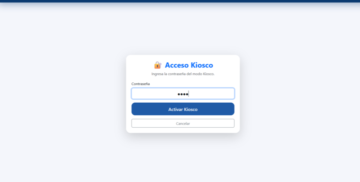
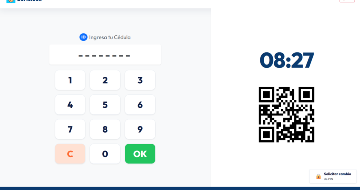
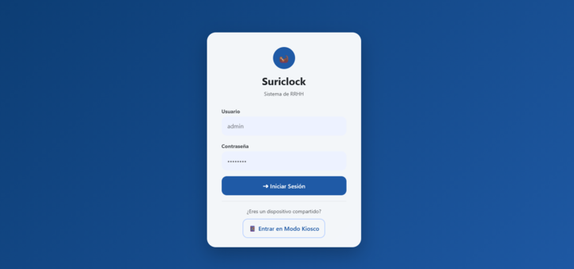
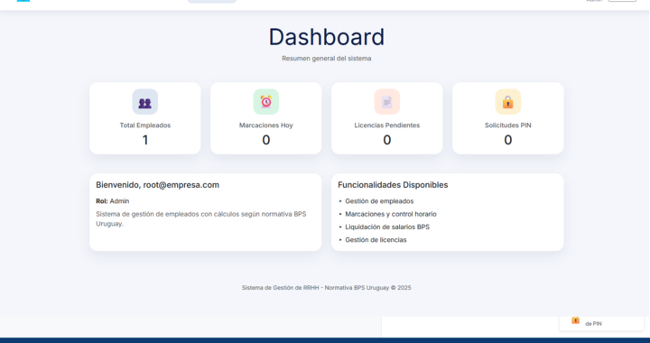
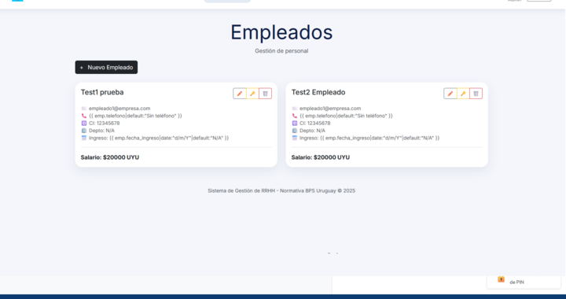

<div align="center">

# Suriclock · Sistema de Control Horario

**Plataforma moderna para gestión de asistencia y RRHH**

[](https://www.python.org/)
[](https://www.djangoproject.com/)
[](LICENSE)

Suriclock digitaliza el control de asistencia mediante kioscos QR inteligentes y un panel administrativo completo. Diseñado para cumplir con normativas laborales (como BPS Uruguay), facilita la gestión de horas, extras y licencias.

[Características](#características-principales) • [Instalación](#puesta-en-marcha-rápida) • [Capturas](#galería-de-capturas)

</div>

---

## Galería de Capturas

### 📱 Kiosco de Asistencia
Interfaz optimizada para tablets y móviles. Permite marcación rápida por QR o PIN personal.

| Acceso Seguro | Marcación Rápida |
|:---:|:---:|
|  |  |
| *Protección por contraseña para modo kiosco* | *Teclado numérico y código QR dinámico* |

### 💻 Panel Administrativo
Gestión centralizada para el equipo de RRHH.

| Login Admin | Dashboard | Gestión de Empleados |
|:---:|:---:|:---:|
|  |  |  |

---

## Descripción General

Suriclock elimina las planillas manuales y los relojes biométricos costosos.
- **Para el Empleado:** Marcación en segundos, consulta de PIN y transparencia.
- **Para RRHH:** Cálculo automático de horas trabajadas, extras (50%/100%) y nocturnidad. Exportación directa a Google Sheets.

## Características Principales

- **🏢 Gestión Integral:** Altas, bajas y modificaciones de empleados y sectores.
- **📍 Geocercas:** Restricción de marcajes por ubicación GPS (opcional por sector).
- **⏰ Cálculo de Horas:** Procesamiento automático de jornadas, descansos y horas extra.
- **📊 Reportes:** Dashboard con métricas en tiempo real y exportación de datos.
- **🔗 Sincronización:** Integración nativa con Google Sheets para respaldos y análisis.
- **🧹 Mantenimiento:** Limpieza automática de fotos antiguas para optimizar espacio.

## Arquitectura

El sistema está construido sobre **Django 4.2**, utilizando tecnologías robustas y probadas:
- **Backend:** Python, Django, WhiteNoise.
- **Base de Datos:** PostgreSQL (Producción) / SQLite (Desarrollo).
- **Frontend:** Bootstrap 5, HTML5, JavaScript (Vanilla).
- **Módulos:**
    - `attendance`: Core del negocio.
    - `google_sheets`: Integración con API de Google.
    - `pwa`: Capacidades offline y manifest.

## Puesta en Marcha Rápida

### Requisitos
- Python 3.11+
- Git

### Instalación

```bash
# 1. Clonar repositorio
git clone https://github.com/<tu-org>/suriclock.git
cd suriclock

# 2. Configurar entorno virtual
python -m venv venv
source venv/bin/activate  # Windows: .\venv\Scripts\activate

# 3. Instalar dependencias
pip install -r requirements.txt

# 4. Configurar variables
cp env.example .env
# Edita .env con tus credenciales

# 5. Inicializar base de datos
python manage.py migrate
python manage.py createsuperuser

# 6. Iniciar servidor
python manage.py runserver 0.0.0.0:8000
```

Accede a:
- **Kiosco:** `http://localhost:8000`
- **Admin:** `http://localhost:8000/admin/`

## Operación Diaria

1.  **Panel Admin**: Configura los **Sectores** y da de alta a los **Empleados**.
2.  **Kiosco**: Despliega el kiosco en una tablet en el lugar de trabajo.
3.  **Marcación**: Los empleados usan su PIN o escanean el QR.
4.  **Cierre**: Revisa el reporte de asistencia y sincroniza con Google Sheets.

## Mantenimiento

| Tarea | Comando | Frecuencia |
| --- | --- | --- |
| Limpiar fotos antiguas | `python manage.py purge_old_photos` | Diario |
| Sincronizar Sheets | `python manage.py sync_sheets` | Horario/Diario |
| Backup BD | `python manage.py dumpdata > backup.json` | Semanal |

## Estructura del Proyecto

```text
suriclock/
├── attendance/      # Lógica principal y vistas
├── docs/            # Documentación y capturas
├── google_sheets/   # Scripts de integración
├── media/           # Archivos generados (fotos, etc)
├── pwa/             # Configuración Progressive Web App
└── manage.py        # CLI de Django
```

## Créditos

Desarrollado con ❤️ para modernizar la gestión de RRHH.
Basado en conceptos de "QR Attendance System" y mejorado por la comunidad Suriclock.

 ## DEDICADO A ALVARO (EL MUERTO)

¿Encontraste un bug? [Abre un issue](https://github.com/<tu-org>/suriclock/issues).
